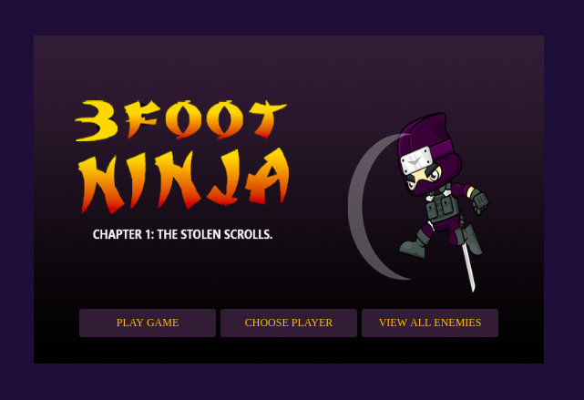
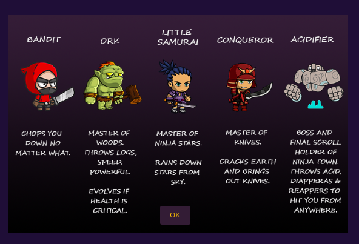
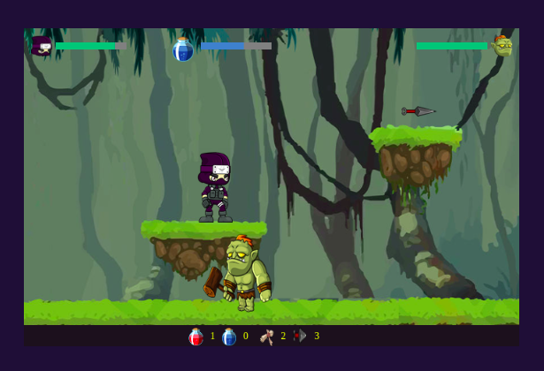
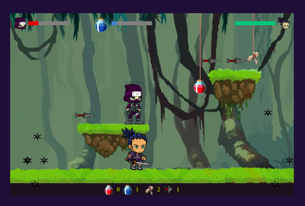

## 3 Foot Ninja 

A game completed as a final project assignment inspired from the classic mini-clip game: 3 Foot Ninja.

## Story

Three long years have passed since our little warriors' journey began.

After the dark and treacherous that led him to the Elders' scrolls our little hero was celebrated throughout the Kingdoms. Word spread quickly of this "little warrior for the people" and everywhere he went, folks of all culture and ages welcomed him to their homes.

But as his fame and his face became known, so his enemies sworn vengance. Dark lord know as Acidifier sent out his killers to find and take out our little Ninja. But each attempt at his life failed and the Lord grew impatient.

Deep in the bowels of evil, the hated lords raised armies and prepared to smite the land of living. Monstrosities were born that would be no match to any man. Fires burned day and night and the sounds of metal being hammered into deadly weapons and armor could be heard for miles.

So that it came to be that on this day a week ago, our little hero received news that the south had been overtaken of dead and mutated armies.

Towns were burned and it's inhabitants slain or shackled. The King of the southern lands has lost his daughter in a siege of the castle.

Now our little warrior is off to lend his hand in the recovery of the hidden scrolls and to save the village.

## Features

- Choose between characters(male/female)
- 5 Different levels of enemies
- Health potions
- Speed potions
- Platforming

## Tools Used

- HTML5
- CSS
- Vanilla JavaScript

## Screenshots

